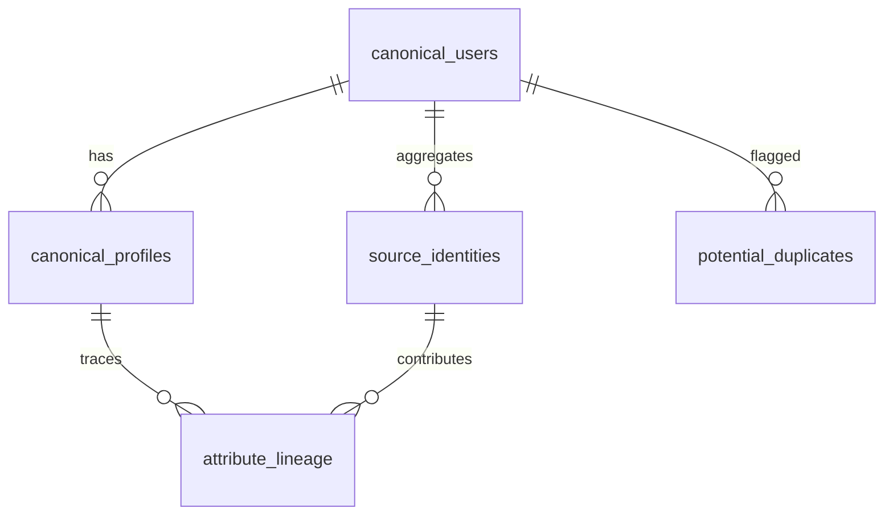

# Master Data Service Data Model

## Entity-Relationship Overview



## Tables

### canonical_users

| Column | Type | Constraints | Notes |
| --- | --- | --- | --- |
| `id` | UUID | Primary key | Stable canonical user identifier exposed to downstream systems. |
| `legacy_ids` | JSONB | | Map of source system identifiers (CRM, auth provider, etc.). |
| `status` | ENUM(`active`, `inactive`, `merged`, `deleted`) | Not null | Tracks lifecycle state. |
| `created_at` | TIMESTAMP WITH TIME ZONE | Default now() | Creation timestamp. |
| `updated_at` | TIMESTAMP WITH TIME ZONE | Default now() | Updated via trigger on write. |

### canonical_profiles

| Column | Type | Constraints | Notes |
| --- | --- | --- | --- |
| `id` | UUID | Primary key | |
| `canonical_user_id` | UUID | FK → `canonical_users.id` | |
| `full_name` | TEXT | | Normalized display name. |
| `email` | CITEXT | Unique | Lower-cased email for deterministic dedupe. |
| `phone_e164` | TEXT | | Normalized phone stored without formatting. |
| `country_code` | CHAR(2) | | ISO-3166 alpha-2. |
| `preferences` | JSONB | | Aggregated structured preferences. |
| `version` | BIGINT | Not null, default 0 | Incremented on every update for OCC. |
| `updated_at` | TIMESTAMP WITH TIME ZONE | Default now() | |

### source_identities

| Column | Type | Constraints | Notes |
| --- | --- | --- | --- |
| `id` | BIGSERIAL | Primary key | |
| `canonical_user_id` | UUID | Nullable FK → `canonical_users.id` | Null when unresolved. |
| `source_system` | TEXT | Not null | e.g., `user-service`, `marketing-crm`. |
| `source_record_id` | TEXT | Not null | Identifier in source system. |
| `ingested_payload` | JSONB | | Original payload retained for audit. |
| `ingested_at` | TIMESTAMP WITH TIME ZONE | Default now() | |
| `match_score` | NUMERIC(5,2) | | Confidence score from dedupe engine. |
| `match_method` | TEXT | | `deterministic`, `probabilistic`, `manual`. |

### attribute_lineage

| Column | Type | Constraints | Notes |
| --- | --- | --- | --- |
| `id` | BIGSERIAL | Primary key | |
| `canonical_profile_id` | UUID | FK → `canonical_profiles.id` | |
| `attribute_path` | TEXT | Not null | JSONPath-style pointer (e.g., `$.email`). |
| `source_identity_id` | BIGINT | FK → `source_identities.id` | |
| `value_hash` | TEXT | | Hash of stored attribute for tamper detection. |
| `confidence` | NUMERIC(5,2) | | Confidence in this attribute value. |
| `valid_from` | TIMESTAMP WITH TIME ZONE | | Start time for attribute validity. |
| `valid_to` | TIMESTAMP WITH TIME ZONE | Nullable | Null means currently authoritative. |

### potential_duplicates

| Column | Type | Constraints | Notes |
| --- | --- | --- | --- |
| `id` | BIGSERIAL | Primary key | |
| `candidate_user_id` | UUID | Not null | Either canonical user or unresolved candidate. |
| `possible_match_user_id` | UUID | Not null | Canonical user flagged as potential duplicate. |
| `match_score` | NUMERIC(5,2) | | |
| `state` | ENUM(`pending`, `auto_merged`, `dismissed`, `escalated`) | Default `pending` | |
| `escalation_reason` | TEXT | | Populated when manual review required. |
| `last_reviewed_at` | TIMESTAMP WITH TIME ZONE | | |

## Migration Strategy

1. Create base tables with necessary indexes (email unique, partial indexes for active users, etc.).
2. Introduce PostgreSQL `citext` extension for case-insensitive comparisons.
3. Use optimistic concurrency via `canonical_profiles.version` when applying updates.
4. Maintain history tables via CDC rather than in-database triggers to keep the core tables lean.

## Indexing Guidelines

- Unique index on `canonical_profiles.email` with `WHERE email IS NOT NULL`.
- B-tree indexes on `phone_e164`, `source_system`, and `match_score` for ingestion queries.
- GIN index on `legacy_ids` to accelerate lookups by external identifiers.

## Sample Migration (pseudo SQL)

```sql
CREATE EXTENSION IF NOT EXISTS citext;

CREATE TABLE canonical_users (
    id UUID PRIMARY KEY DEFAULT gen_random_uuid(),
    legacy_ids JSONB DEFAULT '{}'::jsonb,
    status canonical_user_status NOT NULL DEFAULT 'active',
    created_at TIMESTAMPTZ NOT NULL DEFAULT now(),
    updated_at TIMESTAMPTZ NOT NULL DEFAULT now()
);
```

Detailed migrations live in the `migrations/` directory.
